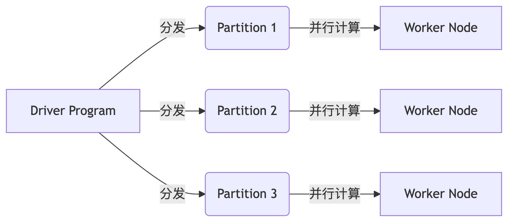

# **Spark RDD（弹性分布式数据集）**
**Resilient Distributed Dataset**

## **核心特性**
| 特性                | 说明                                                                 |
|---------------------|----------------------------------------------------------------------|
| **分布式对象**       | 跨集群节点分布的数据集合，封装为 Python/Java/Scala 对象              |
| **弹性（Resilient）** | 支持故障自动恢复（通过血缘关系 Lineage 重建丢失分区）                |
| **不可变性**         | 创建后不能修改，只能通过转换操作生成新的 RDD                         |
| **延迟计算**         | 转换操作（如 `map`）延迟执行，直到遇到行动操作（如 `collect`）触发计算 |

## **核心优势**
### 1. **减小数据规模**
- **分区机制**：数据自动划分为多个分区（Partition），每个分区可在不同节点并行处理
- **内存计算**：支持缓存到内存（`persist()`），避免重复磁盘 I/O

### 2. **并行计算**
- **任务并行**：每个分区独立处理，自动调度到集群节点执行
- **操作类型**：
    - **转换（Transformation）**：生成新 RDD（如 `map`, `filter`, `groupByKey`）
    - **行动（Action）**：触发计算并返回结果（如 `count`, `collect`, `saveAsTextFile`）

## **代码示例**
### 创建 RDD
```python
from pyspark import SparkContext
sc = SparkContext()

# 从集合创建（并行化）
data = [1, 2, 3, 4, 5]
rdd = sc.parallelize(data, numSlices=3)  # 分3个分区

# 从文件创建
file_rdd = sc.textFile("hdfs://path/to/file.txt")
```

### 常用操作
```python
# 转换操作（Lazy）
squared = rdd.map(lambda x: x**2)          # 映射
filtered = rdd.filter(lambda x: x > 2)     # 过滤

# 行动操作（立即执行）
print(squared.collect())                   # 输出: [1, 4, 9, 16, 25]
print(filtered.count())                    # 输出: 3
```

## **架构图示**


---

### **关键设计思想**
- **数据本地性**：调度时优先将计算任务分配给存储对应分区的节点
- **窄/宽依赖**：优化任务划分（窄依赖可流水线执行，宽依赖需 Shuffle）

通过 RDD 模型，Spark 实现了高效的**内存计算**和**容错机制**，适合迭代式算法和交互式数据分析。

为什么要做成分布式？

为了加速运算。能拆分数据集，缩小数据规模。并行化计算